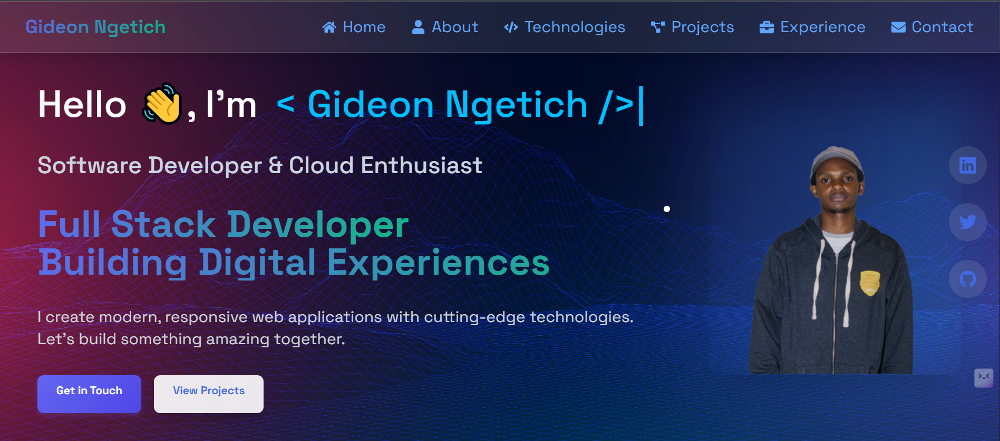

# Gideon Ngetich Portfolio 👨‍💻☁️

Welcome to my personal portfolio website! Explore my projects, experience, and skills all in one sleek and interactive place.

Click the image above or visit [https://www.gideonngetich.me/](https://www.gideonngetich.me/) to see the live site.

---

## Technologies & Tools Used

- **React** with TypeScript for a robust and scalable frontend.
- **Tailwind CSS** for modern, responsive, and utility-first styling.
- **Vite** for lightning-fast development and build process.
- **Framer Motion** and custom **CSS animations** for smooth and engaging UI transitions.
- **React Hooks** for state management and side effects.
- **ESLint** and **Prettier** for clean, consistent code.

---

## Features

- Dynamic typing effect to showcase skills and roles.
- Interactive navbar with smooth scrolling.
- Responsive design optimized for all devices.
- Confetti animation for celebratory effects.
- Organized sections: About, Experience, Projects, Technologies, Education, Community Involvement, Certification, and Contact.

---

Feel free to explore the code and reach out via the contact section!

---

*Crafted with passion and creativity ❤ by Gideon Ngetich.*
